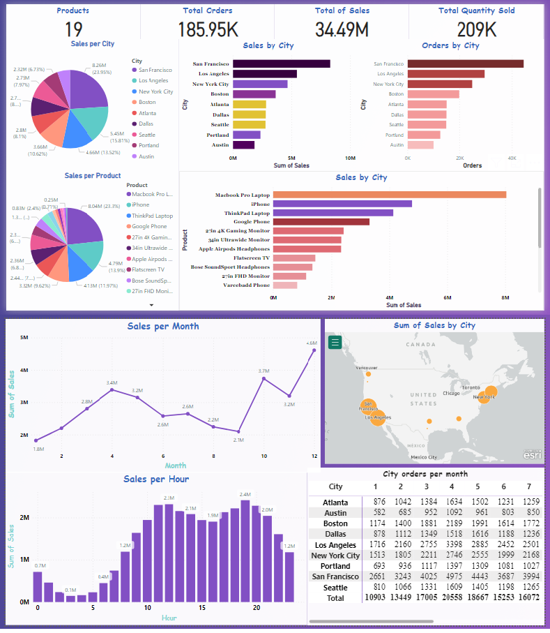

<h1 align='center'> Sales Data Analysis</h1>
<h2 font size='100'>Yossef Essam </h2>
<h3 align='center'> Merskill data analysis Internship   </h3>
<table alt="Contact Details" align="right">
  <tr>
    <td></td>
    <td><a href="https://t.me/YossefEFM"> </ing></a></td>
    <td><a href="https://www.linkedin.com/in/yossefessam1408/"></td>
    <td><a href="https://api.whatsapp.com/send?phone=201068105975"></td>
    <td></td>
  </tr>
</table>

