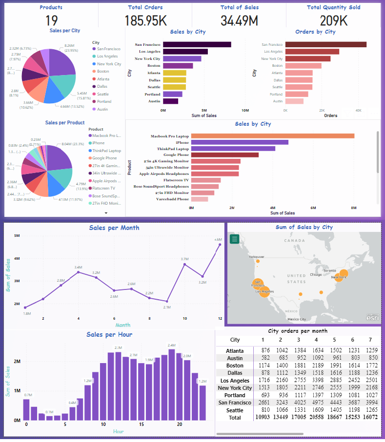

> # **ENG.Yossef Essam**
> <table alt="Contact Details" align="center">
  <tr>
    <td></td>
    <td><a href="https://t.me/YossefEFM"> </ing></a></td>
    <td><a href="https://www.linkedin.com/in/yossefessam1408/"></td>
    <td><a href="https://api.whatsapp.com/send?phone=201068105975"></td>
    <td></td>
  </tr>
</table>
      
> <h1 align='center'> Sales Data Analysis</h1>

> **Analyze sales data to identify trends, top-selling products, and revenue metrics for business decision making.**
> 
